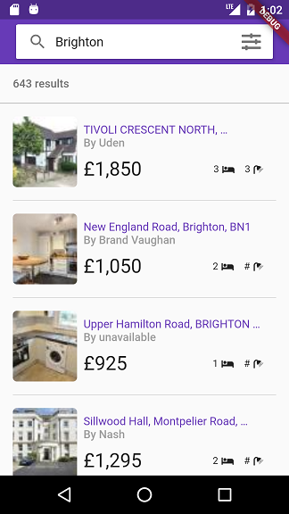
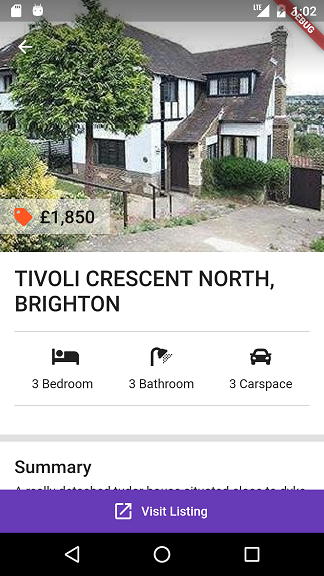

# flutter_property_finder

A property listings app built using Flutter sdk. 

## Tutorial Link
Watch as i guide you step by step on how to build this application from scratch. 
YouTube Playlist [here](https://www.youtube.com/watch?v=DLbD9XPnUQc&list=PLkf3n4moMnEC8QwziPjTW1tOa3SIqBk6B)

### What you'll learn
- JSON serialization using built_value
- State management using scoped_model
- Transforming JSON during decoding
- How to use Slivers
- Creating reusable UI widgets
- Building beautiful UIs
- and lots more

## Screenshots

 

## Getting Started

For help getting started with Flutter, view our online
[documentation](https://flutter.io/).
